% Generated by scripts/gallery.py -- edit the registry there and rerun
% `make gallery` (or `--page-only` for markup changes); the
% screenshots and this page are written together.

# Gallery

Every GUI component, as the browser renders it; each tile links to
its API reference. `gui` is `server.gui` -- or any
[container](api/gui_handles.rst) such as a folder, tab, or modal,
which accepts the same calls. The figures follow the documentation's
light or dark theme.

## Controls

```{raw} html
<div class="gallery-grid">
<a class="gallery-card" href="api/gui.html#leika.GuiApi.add_slider">
<span class="gallery-media">
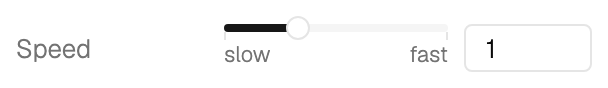
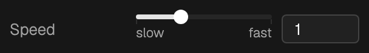
</span>
<span class="gallery-caption">
<span>Slider</span>
<code>add_slider()</code>
</span>
</a>
<a class="gallery-card" href="api/gui.html#leika.GuiApi.add_multi_slider">
<span class="gallery-media">
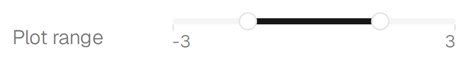
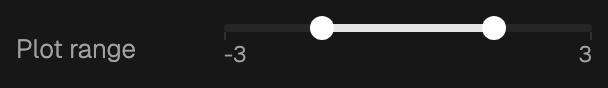
</span>
<span class="gallery-caption">
<span>Multi slider</span>
<code>add_multi_slider()</code>
</span>
</a>
<a class="gallery-card" href="api/gui.html#leika.GuiApi.add_number">
<span class="gallery-media">
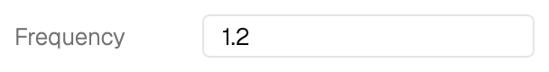
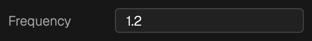
</span>
<span class="gallery-caption">
<span>Number</span>
<code>add_number()</code>
</span>
</a>
<a class="gallery-card" href="api/gui.html#leika.GuiApi.add_vector2">
<span class="gallery-media">
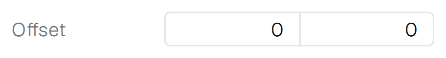
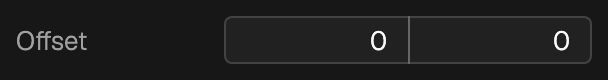
</span>
<span class="gallery-caption">
<span>Vector2</span>
<code>add_vector2()</code>
</span>
</a>
<a class="gallery-card" href="api/gui.html#leika.GuiApi.add_vector3">
<span class="gallery-media">
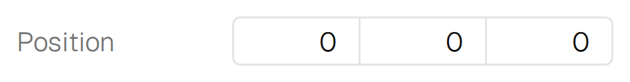
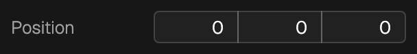
</span>
<span class="gallery-caption">
<span>Vector3</span>
<code>add_vector3()</code>
</span>
</a>
<a class="gallery-card" href="api/gui.html#leika.GuiApi.add_text">
<span class="gallery-media">
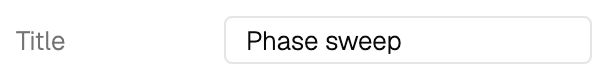
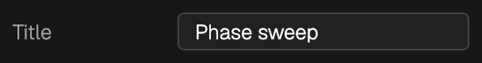
</span>
<span class="gallery-caption">
<span>Text</span>
<code>add_text()</code>
</span>
</a>
<a class="gallery-card" href="api/gui.html#leika.GuiApi.add_text">
<span class="gallery-media">
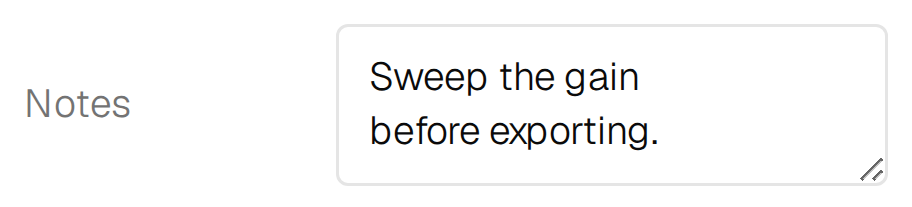
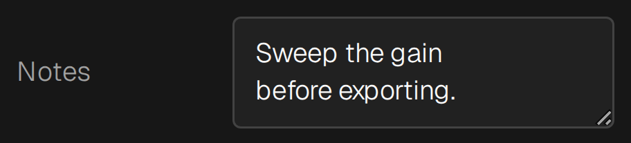
</span>
<span class="gallery-caption">
<span>Multiline text</span>
<code>add_text()</code>
</span>
</a>
<a class="gallery-card" href="api/gui.html#leika.GuiApi.add_text">
<span class="gallery-media">
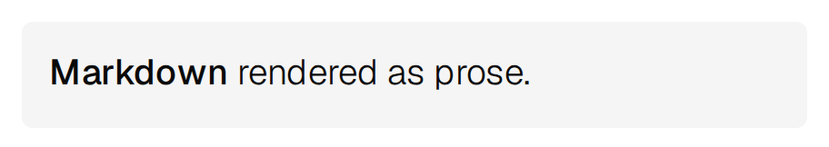

</span>
<span class="gallery-caption">
<span>Markdown text</span>
<code>add_text()</code>
</span>
</a>
<a class="gallery-card" href="api/gui.html#leika.GuiApi.add_list">
<span class="gallery-media">
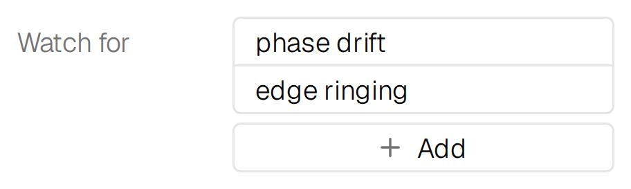
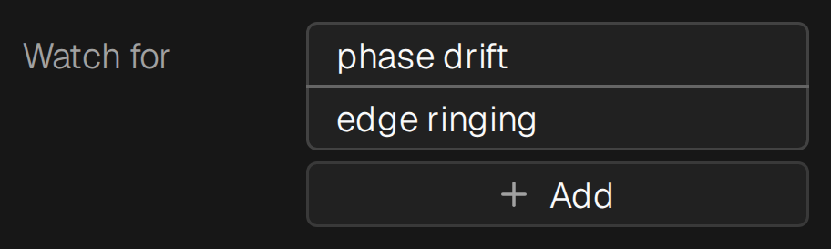
</span>
<span class="gallery-caption">
<span>List</span>
<code>add_list()</code>
</span>
</a>
<a class="gallery-card" href="api/gui.html#leika.GuiApi.add_checklist">
<span class="gallery-media">
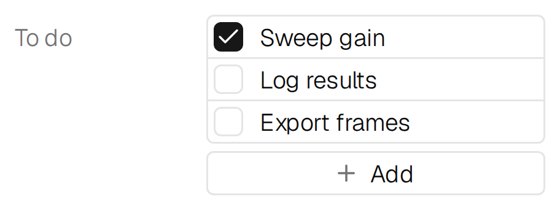
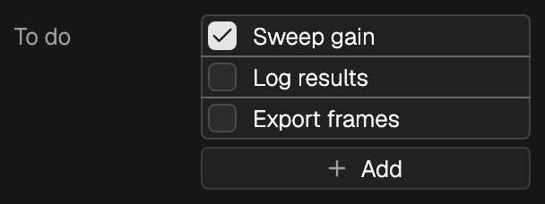
</span>
<span class="gallery-caption">
<span>Checklist</span>
<code>add_checklist()</code>
</span>
</a>
<a class="gallery-card" href="api/gui.html#leika.GuiApi.add_checklist">
<span class="gallery-media">


</span>
<span class="gallery-caption">
<span>Frozen checklist</span>
<code>add_checklist()</code>
</span>
</a>
<a class="gallery-card" href="api/gui.html#leika.GuiApi.add_checkbox">
<span class="gallery-media">


</span>
<span class="gallery-caption">
<span>Checkbox</span>
<code>add_checkbox()</code>
</span>
</a>
<a class="gallery-card" href="api/gui.html#leika.GuiApi.add_dropdown">
<span class="gallery-media">
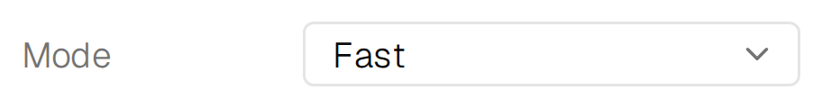

</span>
<span class="gallery-caption">
<span>Dropdown</span>
<code>add_dropdown()</code>
</span>
</a>
<a class="gallery-card" href="api/gui.html#leika.GuiApi.add_dropdown">
<span class="gallery-media">
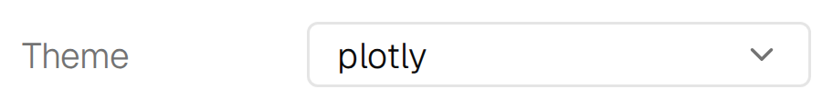

</span>
<span class="gallery-caption">
<span>Searchable dropdown</span>
<code>add_dropdown()</code>
</span>
</a>
<a class="gallery-card" href="api/gui.html#leika.GuiApi.add_toggle">
<span class="gallery-media">
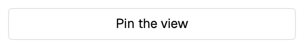
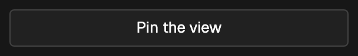
</span>
<span class="gallery-caption">
<span>Toggle</span>
<code>add_toggle()</code>
</span>
</a>
<a class="gallery-card" href="api/gui.html#leika.GuiApi.add_toggle">
<span class="gallery-media">
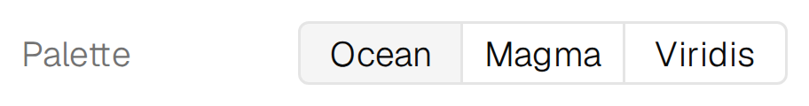
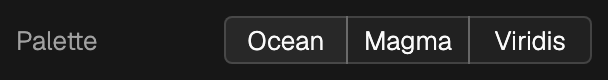
</span>
<span class="gallery-caption">
<span>Toggle group</span>
<code>add_toggle()</code>
</span>
</a>
<a class="gallery-card" href="api/gui.html#leika.GuiApi.add_rgb">
<span class="gallery-media">
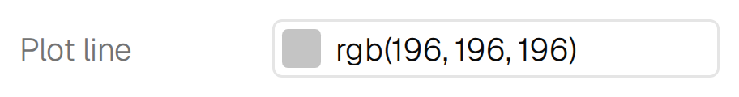
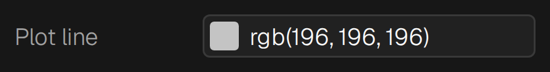
</span>
<span class="gallery-caption">
<span>RGB color</span>
<code>add_rgb()</code>
</span>
</a>
<a class="gallery-card" href="api/gui.html#leika.GuiApi.add_rgba">
<span class="gallery-media">
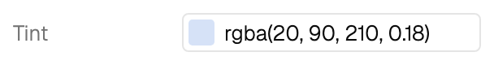
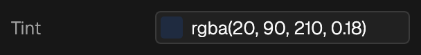
</span>
<span class="gallery-caption">
<span>RGBA color</span>
<code>add_rgba()</code>
</span>
</a>
<a class="gallery-card" href="api/gui.html#leika.GuiApi.add_progress_bar">
<span class="gallery-media">


</span>
<span class="gallery-caption">
<span>Progress bar</span>
<code>add_progress_bar()</code>
</span>
</a>
<a class="gallery-card" href="api/gui.html#leika.GuiApi.add_divider">
<span class="gallery-media">


</span>
<span class="gallery-caption">
<span>Divider</span>
<code>add_divider()</code>
</span>
</a>
<a class="gallery-card" href="api/gui.html#leika.GuiApi.add_button">
<span class="gallery-media">
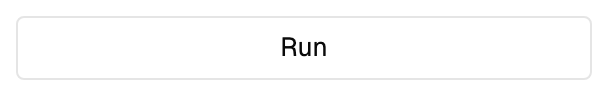
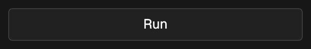
</span>
<span class="gallery-caption">
<span>Button</span>
<code>add_button()</code>
</span>
</a>
<a class="gallery-card" href="api/gui.html#leika.GuiApi.add_button">
<span class="gallery-media">
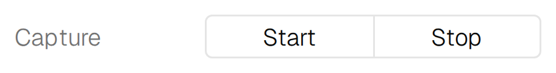
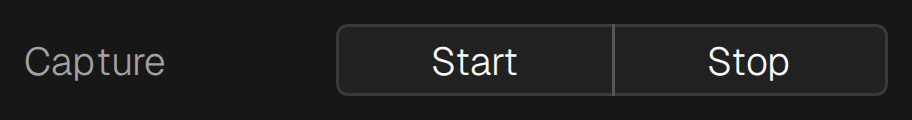
</span>
<span class="gallery-caption">
<span>Button group</span>
<code>add_button()</code>
</span>
</a>
<a class="gallery-card" href="api/gui.html#leika.GuiApi.add_upload_button">
<span class="gallery-media">


</span>
<span class="gallery-caption">
<span>Upload button</span>
<code>add_upload_button()</code>
</span>
</a>
<a class="gallery-card" href="api/gui.html#leika.GuiApi.add_download_button">
<span class="gallery-media">
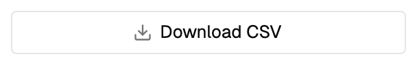
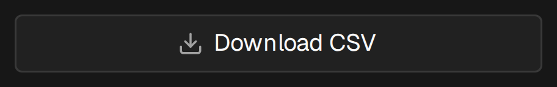
</span>
<span class="gallery-caption">
<span>Download button</span>
<code>add_download_button()</code>
</span>
</a>
<a class="gallery-card" href="api/gui.html#leika.GuiApi.add_preview_button">
<span class="gallery-media">
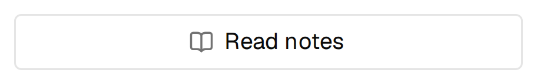
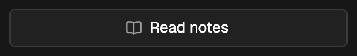
</span>
<span class="gallery-caption">
<span>Preview button</span>
<code>add_preview_button()</code>
</span>
</a>
</div>
```

## Containers and overlays

```{raw} html
<div class="gallery-grid">
<a class="gallery-card" href="api/gui.html#leika.GuiApi.add_folder">
<span class="gallery-media">
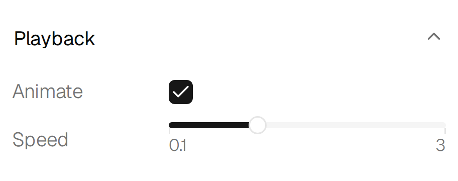
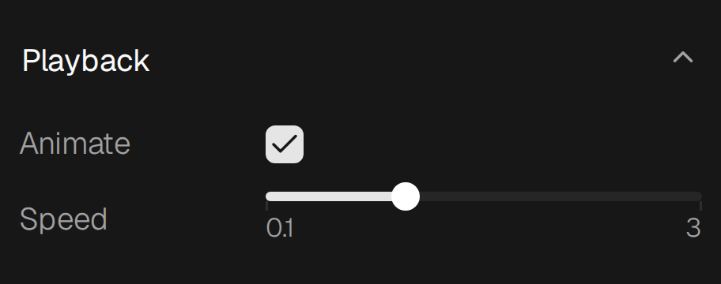
</span>
<span class="gallery-caption">
<span>Folder</span>
<code>add_folder()</code>
</span>
</a>
<a class="gallery-card" href="api/gui.html#leika.GuiApi.add_form">
<span class="gallery-media">
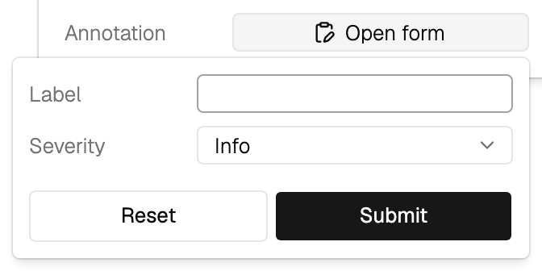
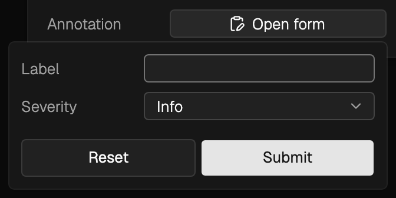
</span>
<span class="gallery-caption">
<span>Form</span>
<code>add_form()</code>
</span>
</a>
<a class="gallery-card" href="api/gui.html#leika.GuiApi.add_mini_form">
<span class="gallery-media">


</span>
<span class="gallery-caption">
<span>Mini form</span>
<code>add_mini_form()</code>
</span>
</a>
<a class="gallery-card" href="api/gui.html#leika.GuiApi.add_tab_group">
<span class="gallery-media">
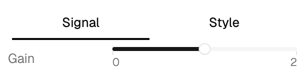
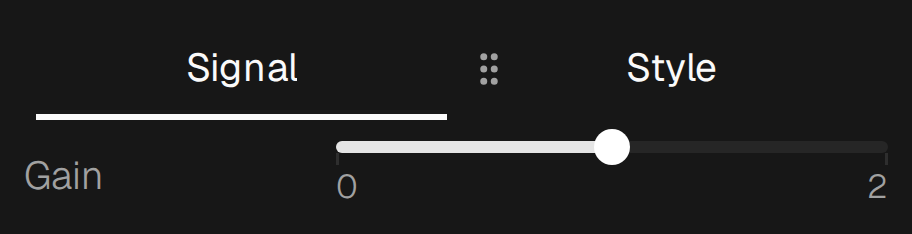
</span>
<span class="gallery-caption">
<span>Tab group</span>
<code>add_tab_group()</code>
</span>
</a>
<a class="gallery-card" href="api/gui.html#leika.GuiApi.add_modal">
<span class="gallery-media">
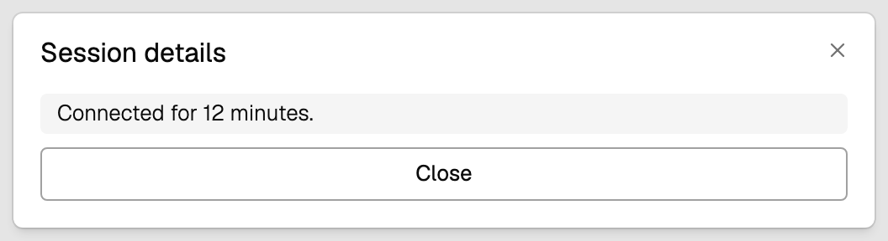
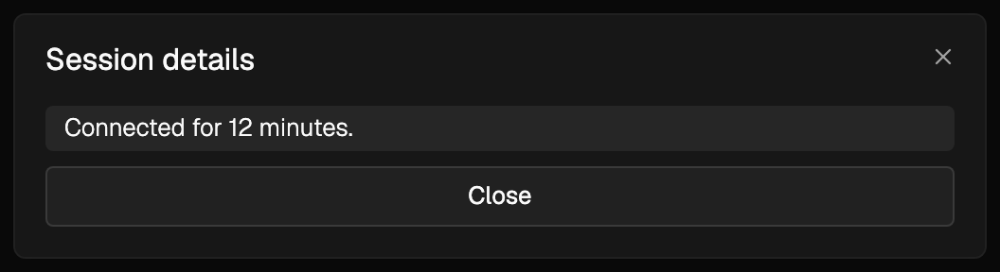
</span>
<span class="gallery-caption">
<span>Modal</span>
<code>add_modal()</code>
</span>
</a>
<a class="gallery-card" href="api/gui.html#leika.GuiApi.add_notification">
<span class="gallery-media">
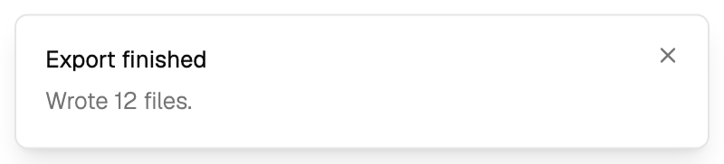
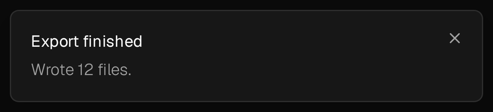
</span>
<span class="gallery-caption">
<span>Notification</span>
<code>add_notification()</code>
</span>
</a>
<a class="gallery-card" href="api/gui.html#leika.GuiApi.add_command">
<span class="gallery-media">
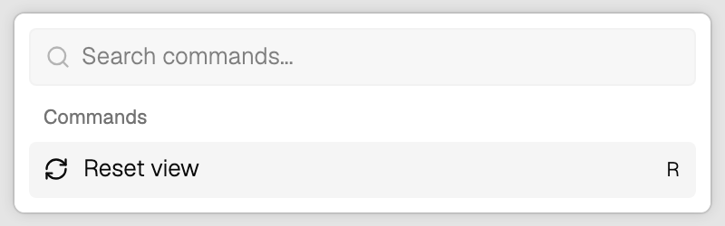
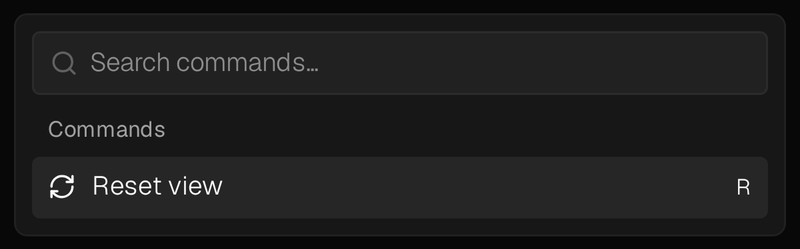
</span>
<span class="gallery-caption">
<span>Command</span>
<code>add_command()</code>
</span>
</a>
</div>
```

## Content

```{raw} html
<div class="gallery-grid">
<a class="gallery-card" href="api/gui.html#leika.GuiApi.add_image">
<span class="gallery-media">


</span>
<span class="gallery-caption">
<span>Image</span>
<code>add_image()</code>
</span>
</a>
<a class="gallery-card" href="api/gui.html#leika.GuiApi.add_html">
<span class="gallery-media">


</span>
<span class="gallery-caption">
<span>HTML</span>
<code>add_html()</code>
</span>
</a>
<a class="gallery-card" href="api/gui.html#leika.GuiApi.add_plotly">
<span class="gallery-media">
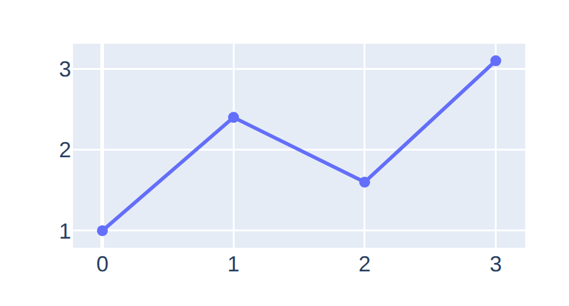

</span>
<span class="gallery-caption">
<span>Plotly figure</span>
<code>add_plotly()</code>
</span>
</a>
</div>
```
